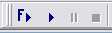



## How and why to add 'Start With Full Compile' button to VB ToolBars

### Description

Explains how and why to put a 'Start with Full Compile' button on VB toolbar. Works in VB4,5,6 and I think 3 (but its so long since I used that I can't remember).
 
### More Info
 

             |
---                |---
**Submitted On**   |
**By**             |[Roger Gilchrist](https://github.com/Planet-Source-Code/PSCIndex/blob/master/ByAuthor/roger-gilchrist.md)
**Level**          |Intermediate
**User Rating**    |4.9 (93 globes from 19 users)
**Compatibility**  |VB 4\.0 \(16\-bit\), VB 4\.0 \(32\-bit\), VB 5\.0, VB 6\.0
**Category**       |[VB function enhancement](https://github.com/Planet-Source-Code/PSCIndex/blob/master/ByCategory/vb-function-enhancement__1-25.md)
**World**          |[Visual Basic](https://github.com/Planet-Source-Code/PSCIndex/blob/master/ByWorld/visual-basic.md)
**Archive File**   |

### Source Code

I've noticed in several downloads that many people don't seem to know about the very useful 'Start With Full Compile' <b>(CTRL+F5)</b> instead of 'Start' <b>(F5)</b> to run code. To read MSDN and VB helpfiles you might think it was only for ActiveX programming, but it makes a great Debug tool for any code.
  
 It finds any structural errors, references to removed controls and (with 'Option Explicit' on every code page) missing variables, takes you to them and halts running code. Much safer than finding errors only once you start running. You might never test the bad code (and you just know the first user will hit it instantly).
 
 Using 'Full Compile' your code won't start until your it is structurally sound. It's not perfect of course and you can still mess up in all sorts of interesting and horrible ways but at least you won't upload any of the boring simple errors.
 
 
To make sure you don't rely on remembering the keyboard shortcut or mousing for the command in the menus (does anyone, anywhere use the Run menu to start their code?), you can create a ToolBar button to use 'Start With Full Compile' as follows:
 
 
1. Right-Click the ToolBar
 
 
2. Select Customize...
 
 
3. Select Commands Tab
 
 
4. Select Run in left pane
 
 
5. Drag 'Start with Full Compile' from the right pane to the ToolBar and drop it where you want it.
 
	 (I put it just to the left of standard 'Run' button (the 'play' arrow))
 
 
6. You could stop here. However the new button is an ugly text only button reading "Start With Full Compile".
 
Microsoft supplied a ToolTip ('Full Start') for the button, but no icon so here's how to give it one.
 
 
7. Leave the Customize tool open
 
 
8. Right-Click the 'Run' button and select 'Copy Button Image' (Menu closes automatically)
 
 
9. Right-Click the new button and select 'Paste Button Image' (Menu closes automatically)
 
 
10. Right-Click it again and select 'Edit Button Image'
 
 
11. Change design so you can tell it from standard 'Run' button (I add a big blue F next to the arrow)
 
 
12. Select 'OK' (Button Image Editor closes)
 
 
13. Right-Click button again and select 'Default Style' (Caption disappears)
 
 
14. Close the Customize Tool.
 
 
Done.
 
 
While you are in the customising tool have a look around and see if there's anything else you'd like to add to the toolbars. The View menu has several interesting things you might like on the toolbar. You can also remove any buttons you don't want by dragging them from the toolbar to the Customize Tool.
 
(I don't remember where I got it this, probably VBPJ. I've used it for so long that when something wiped my toolbars I first tried to find it in the Toolbar Customising system before remembering how to do it).

--------------------------------------End of Original Posting -------------------------------------

<b>OTHER RECOMMENDATIONS</b> 
<b>1.</b> I would recommend 'Ulli's Code Formatter' (Search for this) Version whatever its up to today (It is often updated and once you use it you'll find yourself checking for the latest version regularly. Ulli is very responsive to suggestions). I uses it automatically on any code I upload and any download of more than a couple of panes. You'll be amazed at how many problems it detects in your code, but it is a great teaching tool, you'll find yourself coding neatly just to get the congratulations message for clean code. It lays out your code neatly, finds structural errors, suggests improvements and sets 'Option Explicit' if it is missing. The help system is short (read it all in one go, run the program a few times and re-read it and you'll know your way around)

The best thing Ulli's code does is place markers at suspect points in your code. The most important ones are:
 
<b>':( As Variant ?</b> = any untyped variable or Function. VB is happy with these but treats them as Variant which has the biggest footprint in memory. 
			'For i = 1 to 400' can runs better with 'Dim i As Integer' than 'Dim i', It may only be a small gain in this case but could be significant in math intensive stuff. Also prevents 'Evil Type Coersion' (Variant will happily change your 'i' from an Integer to a Single or a String and create very hard to trace errors)

	Often an untyped Function could just as easily be a Sub. I'm not sure but suspect that if you don't return anything throught the Function Name VB still reserves memory for the potential Variant that the Function could return.

<b>':( Missing Scope </b> = detects Module level Dims (Public or Private is better/more up-to-date), un-Scoped Declarations and Functions (Scoping helps modularity and memory usage and allows you to hide Class functions from rest of program). (The old fasioned Global is automatically converted to Public)

<b>2.</b> See Ulli's 'Did you know...' article and its comments for some other ways to access the Customizing actions.

<b>3.</b> As a bit of self promotion see my 'Extended Find' Using this you can find all the markers Ulli's program puts in your code [ Search for Ulli's ':( ] and quickly edit them. For variables you can then search for them to see if you can work out what it is (this can also find unused variables you can safely delete.) . Also seeing your code this way often leads you to sloopy lumps of code you can tidy up. Apart from Finding Ulli's markers you can also quickly find every place your code uses a variable and check that it's doing so efficiently.

<b>4.</b> I also like James Beer's 'Malicious String Hunter' for checking out downloads for potentially dangerous code. This is a promising new code hoping to replace Minnow's Code Scanner. Thanks James for the *s. (OK, he responded well to my comments on his code and I'm happy to recommend it in turn)

--------------------------------------End of Other Recommendations -------------------------------------

IMPORTANT ADDITIONS FORM COMMENTATORS</b>  (JIC you don't read comments. I added this as a sort of super Comment replying to everything at once and update the article when I've collected a few. I also responded personally to the authors. For simple congratulations, Thank you, they are very welcome.) 
<i>Coding Genius</i> recommends adding Comment Block, Uncomment Block, Indent, Outdent < Customize/Commands/Catagories = Edit near bottom of 'Commands' list>. (I've had this so long I thought it was default)

<i>Syllva Tech Software</i> suggests using File|Make Project1.exe to do the same thing. Seems a bit extreme for debugging and will play havoc with Auto Increase Version numbering if you use that. And you don't get to see your code running if all's well.

<i>Eric O''Sullivan</i> suggests setting the IDE to 'break on all errors' (Tools|Options|General|Error Trapping). But this is a problem if the code path to what you want to test goes through an Error detector you know about. If it hits you can go to Error Trapping [while in Break Mode] turn it off, set a Breakpoint outside the Scope of the error trap and continue (F5). At the Break Point turn it back on and continue into your code. Better Turn it off, set breakpoints just before you enter the the suspect code and another one just after. When you hit the first breakpoint turn error checking on and continue, if you reach the second breakpoint turn it off. <i>Does anyone know of a way to make VB do that automatically? (This may be a RTFM question but someone has to ask them.</i>

<i>Almar Joling</i> points out that if you turn off "compile on demand" (Tools|Options|General) Then F5 / Run button does Full Compile. My way gives option of which way to do it.

<i>Merlin</i> points out there is a delay when you start this way but its very short; my biggest project compiles to just under 2000 KB and I've never felt this delay as being significant.

<i>Ken</i> suggests some more buttons;'Add bookmark','Remove bookmark'... < Customize/Commands/Catagories = Edit near bottom of 'Commands' list> setting this allows you to set bookmarks within the code windows so you can hop between several points in different modules. I've just tried this out and its fantastic for jumping between related functions that happen to be spread around various modules or just widely separated within a module. Note Bookmarks are only for current code session (unfortunately)

